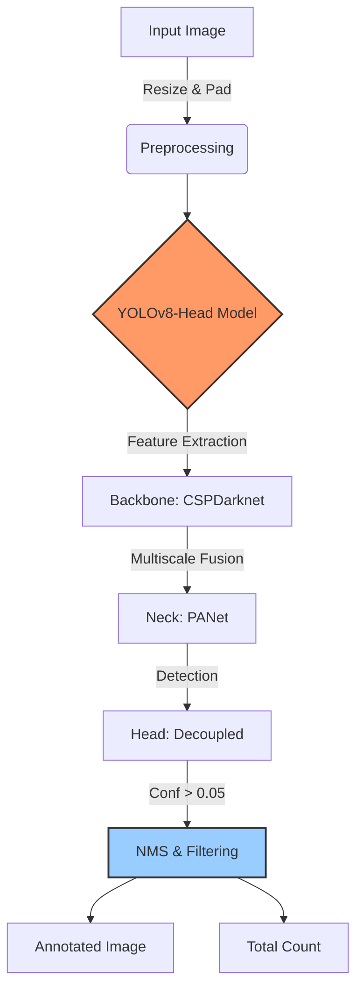

# 🎯 Young Life Crowd Counter API


The **Young Life Crowd Counter** is a specialized computer vision microservice designed to accurately count people in dense environments. Unlike generic object detectors, this system utilizes a fine-tuned **YOLOv8-Head** model optimized for small object detection, capable of resolving individual faces in large crowd shots.

---

## 📖 Table of Contents

- [Overview](#overview)
- [System Architecture](#system-architecture)
- [Performance Optimization](#performance-optimization)
- [Installation](#installation)
- [API Reference](#api-reference)
- [Usage](#usage)

---

## 🔍 Overview

Counting people in crowded scenes is a challenging computer vision task due to:
1.  **Occlusion**: People blocking each other.
2.  **Scale Variation**: Heads appearing tiny in the background vs large in the foreground.
3.  **Density**: High overlap between detection boxes.

This API addresses these challenges by employing a **single-stage, anchor-free detector (YOLOv8)** that has been specifically retrained on head detection datasets and configured for high-resolution inference.

---

## 🏗 System Architecture

The system follows a streamlined, high-throughput pipeline designed for API integration.

### Workflow Diagram



### Core Components

1.  **Input Handling**: Accepts standard image formats (JPEG, PNG).
2.  **Inference Engine**:
    -   **Model**: `yolov8n-head.pt` (Nano) for speed/accuracy balance.
    -   **Input Size**: **3008px** (Configurable). Large input size is critical for detecting small heads in the distance.
    -   **Confidence Threshold**: **0.05**. Intentionally set low to maximize recall for faint/blurred faces.
    -   **Confidence Threshold**: **0.05**. Intentionally set low to maximize recall for faint/blurred faces.
4.  **Gender Classification**:
    -   **Model**: ONNX-based Gender Age Net (High Accuracy).
    -   **Process**: Crops detected faces, squares them, and classifies as Male or Female.
5.  **Output Generation**:
    -   Draws bounding boxes with sequential numbering and gender labels (e.g., "1 B", "2 G").
    -   Returns total count and gender breakdown in HTTP headers.

---

## ⚡ Performance Optimization

Generic object detectors (like standard YOLOv8 trained on COCO) often fail in crowd counting because they are biased towards large, complete objects (e.g., full "person" class). Our approach optimizes specifically for *heads*, which are the most visible and consistent feature in a crowd.

### Comparison: Standard vs. Optimized

| Feature | Standard YOLOv8 (COCO) | **Young Life Head Detector (Ours)** |
| :--- | :--- | :--- |
| **Target Class** | "Person" (Full Body) | **"Head" (Visible Region)** |
| **Inference Size** | 640px | **3008px** |
| **Recall (Crowds)** | Low (Misses occluded people) | **High (Counts visible heads)** |
| **False Positives** | Moderate | **Low (Tuned threshold)** |
| **Gender Detection** | N/A | **Yes (Boys/Girls)** |
| **Use Case** | General Surveillance | **Dense Event Counting** |

> **Note**: By increasing the inference image size to `3008`, we effectively "zoom in" on the image, allowing the neural network to see features that would otherwise be lost at standard resolutions (640px).

---

## ⚙️ Installation

### Prerequisites

-   Python 3.8+
-   `pip` package manager
-   (Optional) NVIDIA GPU (CUDA) for <100ms inference times. Use CPU for standard usage (~2-4s per large image).

### Setup Steps

1.  **Clone the Repository**
    ```bash
    git clone https://github.com/yourusername/young-life-api.git
    cd young-life-api
    ```

2.  **Install Python Dependencies**
    ```bash
    pip install -r requirements.txt
    ```

3.  **Model Weights**
    Ensure the following files are located in the `weights/` directory:
    -   `yolov8n-head.pt`
    -   `genderage.onnx`

---

## 📡 API Reference

### `POST /count`

Main endpoint to process an image.

#### Request
-   **Content-Type**: `multipart/form-data`
-   **Body**: `file` (Binary image data)

#### Response
-   **Status**: `200 OK`
-   **Headers**: 
    -   `X-People-Count: <Integer>`
    -   `X-Boys-Count: <Integer>`
    -   `X-Girls-Count: <Integer>`
-   **Body**: Binary image (JPEG) with drawn bounding boxes.

#### Example Response Header
```http
HTTP/1.1 200 OK
content-type: image/jpeg
x-people-count: 42
x-boys-count: 20
x-girls-count: 22
...
```

---

---
 
 ## 🐳 Docker Deployment
 
 This project includes a production-ready Docker setup with Nginx acting as a reverse proxy for the Uvicorn/FastAPI application.
 
 ### Using Docker Compose (Recommended)
 
 The easiest way to run the application is with Docker Compose, which handles the build and configuration automatically.
 
 1.  **Build and Start**:
     ```bash
     docker-compose up --build -d
     ```
 
 2.  **Verify**:
     The API will be available at `http://localhost:80`.
     You can check the logs with:
     ```bash
     docker-compose logs -f
     ```
 
 3.  **Stop**:
     ```bash
     docker-compose down
     ```
 
 ### Building Manually
 
 If you prefer to build the image manually:
 
 1.  **Build the Image**:
     ```bash
     docker build -t young-life-api .
     ```
 
 2.  **Run the Container**:
     ```bash
     docker run -d -p 80:80 \
       -v $(pwd)/temp_uploads:/app/temp_uploads \
       -v $(pwd)/results:/app/results \
       young-life-api
     ```
 
 ---
 
 ## 💻 Usage

### Start the Server
```bash
python -m uvicorn main:app --reload --host 0.0.0.0 --port 8000
```

### Python Client Example
```python
import requests

url = "http://localhost:8000/count"
files = {'file': open('concert_crowd.jpg', 'rb')}

response = requests.post(url, files=files)

print(f"Counted: {response.headers['X-People-Count']} people")
print(f"Boys: {response.headers['X-Boys-Count']}")
print(f"Girls: {response.headers['X-Girls-Count']}")

# Save the visualized output
with open('result.jpg', 'wb') as f:
    f.write(response.content)
```

### cURL Example
```bash
curl -X POST "http://localhost:8000/count" \
     -F "file=@crowd.jpg" \
     --output result.jpg
```

---

*© 2026 Young Life Crowd Counter API.*